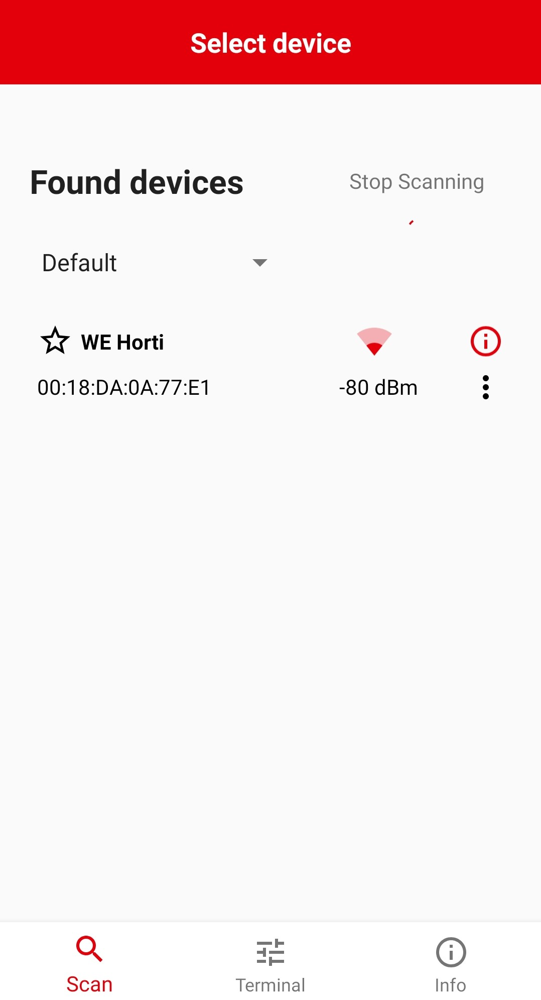
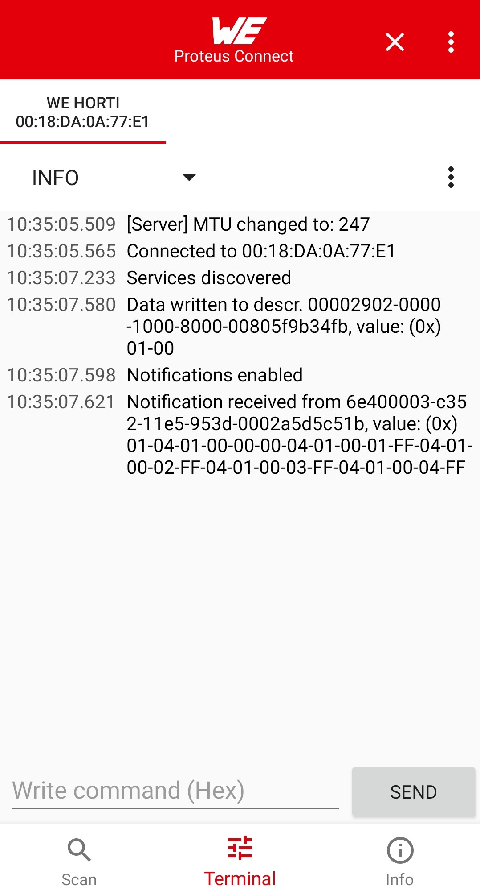
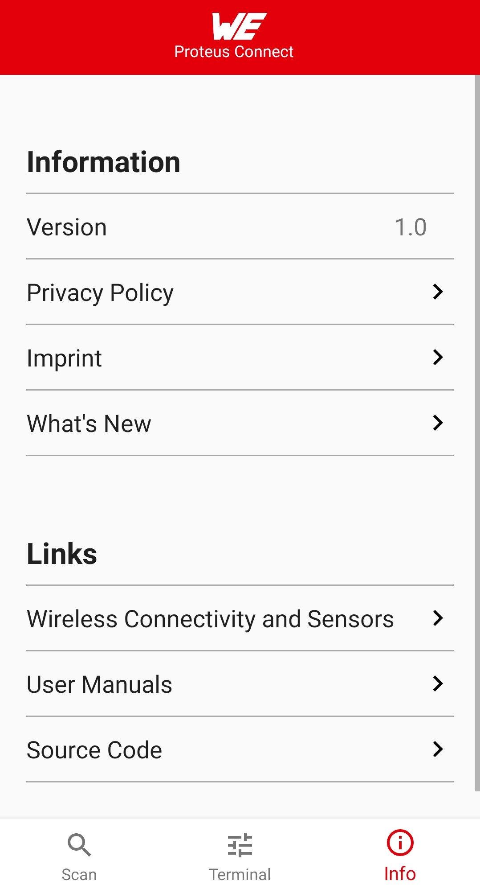

# Proteus Connect Android (Archive)

July 2023 - Note: This SDK is now in status "archive" and will not be continued or maintained. Please refer to https://github.com/WurthElektronik/Proteus-Connect for the successor, which is a cross plattform project supporting Android and iOS as well as web-app.

The Google Play Store will also switch over to the new project starting with version 1.4 of the app release.

-----------------
Archived
-----------------

Contact: https://www.we-online.de/web/en/wuerth_elektronik/kontakte_weg/contacts_weg.php

License Terms: https://github.com/WurthElektronik/Proteus-Connect-Android/blob/master/license_terms_Proteus-Connect_sdk.pdf

Google Play Store: https://play.google.com/store/apps/details?id=com.eisos.android.terminal

GitHub Würth Elektronik eiSos: https://github.com/WurthElektronik

## General information

This Android™ app is developed to send ASCII or HEX commands to connected boards.
Additional features and updates will be released as they are developed.

## Installation

It is highly recommended to uninstall an older version of the app or at least clear the storage
of the app before installing a new version.

Latest version: <a href="Proteus_Connect_v1.3.apk" download>Proteus_Connect_v1.3.apk</a>

## Known issues

* Under Android 10 there will be no callback when a scanned device is not available anymore.

## UI overview

Scan screen                                           | Terminal screen                                           | Info screen
:---------------------------------------------------: | :-------------------------------------------------------: | :---------------------------------------------------:
  |   | 

 > Android is a trademark of Google LLC.
 
 
## Known issues
V1.3.0
 - none
V1.2.0
 - none
V1.1.0
 - sending ascii payload does not log the very first character, the payload however is send correctly.
V1.0.0
 - parsing ascii user input does not work properly, use hex input
 - input conding defaults to ascii, should be hex.

